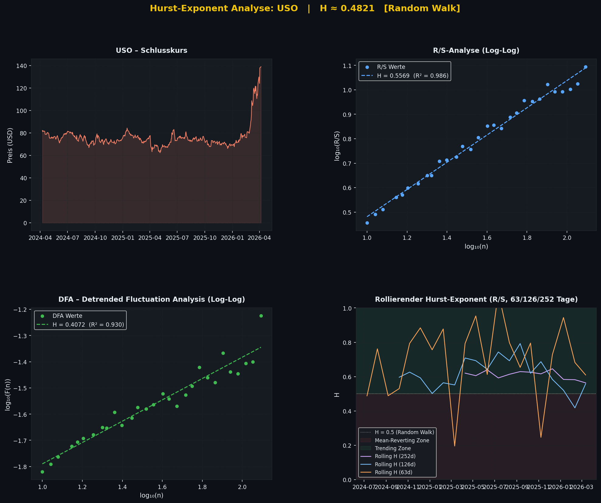

# Hurst Exponent Calculator

A Python tool for calculating the **Hurst Exponent** of financial time series — a statistical measure that reveals whether a market is trending, random, or mean-reverting. Built for systematic traders, options sellers, and anyone who wants to understand the structural character of a market before placing a trade.



*Example output for `USO`, including price history, R/S, DFA, and rolling 63d/126d/252d Hurst series.*

---

## What Is the Hurst Exponent?

The Hurst Exponent (H) is a single number between 0 and 1 that describes the **memory** of a time series:

| H Value | Regime | What It Means |
|---------|--------|---------------|
| H < 0.45 | **Mean-Reverting** | Prices tend to revert after moves. Ideal for short volatility strategies. |
| 0.45 – 0.55 | **Random Walk** | No persistent structure. Neutral environment. |
| H > 0.55 | **Trending** | Prices tend to continue in the same direction. Favors trend following. |

Unlike a moving average — which tells you *where* a trend is going — the Hurst Exponent tells you *whether* trending behavior exists in the first place. It is a **regime detector**, not a directional signal.

---

## Installation

```bash
pip install yfinance numpy pandas matplotlib scipy
```

Python 3.8 or higher is required.

---

## Usage

```bash
# Basic usage — 2-year default window
python src/hurst.py --ticker SPY

# Specify a period
python src/hurst.py --ticker USO --period 5y

# Specify exact date range
python src/hurst.py --ticker MA --start 2022-01-01 --end 2024-12-31

# Use only one calculation method
python src/hurst.py --ticker QQQ --period 3y --method dfa

# Run without chart output
python src/hurst.py --ticker GLD --period 2y --no-plot

# Disable rolling Hurst (enabled by default)
python src/hurst.py --ticker IWM --no-rolling
```

### All Arguments

| Argument | Default | Description |
|----------|---------|-------------|
| `--ticker` | *(required)* | Any ticker symbol supported by Yahoo Finance (e.g. SPY, USO, AAPL, GLD) |
| `--period` | `2y` | Lookback period: `1mo` `3mo` `6mo` `1y` `2y` `5y` `10y` `ytd` `max` |
| `--start` | — | Optional start date in `YYYY-MM-DD` format; used with `--end` |
| `--end` | — | Optional end date in `YYYY-MM-DD` format; used with `--start` |
| `--method` | `both` | Calculation method: `rs`, `dfa`, or `both` |
| `--no-rolling` | off | Disable rolling Hurst calculation (enabled by default) |
| `--no-plot` | off | Suppress chart output, print results to terminal only |
| `--min-window` | `10` | Minimum segment size for the regression (advanced) |

---

## How It Works

The script calculates the Hurst Exponent using two independent methods and compares the results.

### Method 1: R/S Analysis (Rescaled Range)

The classical method introduced by hydrologist Harold Hurst in 1951, later applied to financial markets by Benoit Mandelbrot.

**Steps:**
1. Divide the log-return series into segments of varying length *n*
2. For each segment, calculate the **Range R** (max cumulative deviation minus min) and the **Standard Deviation S**
3. Compute the ratio R/S for each segment length
4. Plot log(R/S) against log(n)
5. The **slope of the regression line** is H

If the slope is greater than 0.5, the series has long-term memory — returns are positively autocorrelated and trends persist. If the slope is below 0.5, returns are negatively autocorrelated and the series mean-reverts.

### Method 2: DFA (Detrended Fluctuation Analysis)

A more modern and robust approach, better suited to non-stationary financial series.

**Steps:**
1. Integrate the return series (cumulative sum of deviations from the mean)
2. Divide into segments of length *n*
3. For each segment, fit and remove a **linear trend** (DFA-1)
4. Calculate the root-mean-square fluctuation F(n) of the residuals
5. Plot log(F(n)) against log(n)
6. The **slope** is H

DFA is less susceptible to short-term autocorrelation artifacts and tends to give more conservative estimates than R/S, which can overestimate H for short series.

### Rolling Hurst

In addition to the full-period calculation, the script computes **rolling Hurst Exponents** for 252-day, 126-day, and 63-day windows, each stepping forward every 21 days. This gives a long-, medium-, and shorter-term view of regime change, which is critical for understanding *when* a market changes character, not just what its average behavior looks like.

### Output

- **Terminal report** with H values, R², standard errors, and a plain-language interpretation
- **4-panel chart** saved as `hurst_<TICKER>.png`:
  - Price history
  - R/S log-log regression plot
  - DFA log-log regression plot
  - Rolling Hurst over time for 252d, 126d, and 63d windows with trending/mean-reverting zones highlighted

---

## Practical Applications

### For Options Sellers / Premium Writers

The Hurst Exponent answers one of the most important pre-trade questions: *is this underlying likely to stay within a range, or is it likely to trend away from my short strikes?*

- **H < 0.48 → favorable environment** for short strangles, iron condors, and cash-secured puts. The underlying oscillates and tends to revert, which means collected premium has a higher probability of expiring worthless.
- **H > 0.55 → elevated risk** for short volatility structures. The market has momentum — one side of your strangle can go deep in-the-money and stay there.

A practical rule: check the 63-day rolling H before opening a new position. If H is above 0.52, consider widening your strikes, reducing position size, or waiting for the regime to normalize.

### For Trend Followers

H > 0.55 is statistical confirmation that trend-following signals (moving average crossovers, breakouts, momentum) have structural support. The market is not in a random walk — persistence is measurable. This provides a principled basis for staying in winning trades longer and trusting the trend.

### For Strategy Selection

Use Hurst as a **meta-filter** before applying other signals:

```
IF Rolling H (63d) > 0.55:
    Activate trend-following rules
    Widen or avoid short-vol positions

IF Rolling H (63d) < 0.45:
    Activate mean-reversion rules (short strangles, range trading)
    Ignore trend signals — they will generate whipsaws
```

### For Risk Management

The rolling chart is particularly valuable. A sudden shift in H from below 0.5 to above 0.6 — as seen in USO during the 2026 Hormuz crisis — is an early warning that the market character has changed. Combined with IV Rank or VIX, it can help you recognize when a low-volatility range environment is transitioning into a trending regime before the damage is done.

---

## Limitations and Honest Caveats

The Hurst Exponent is a powerful concept, but it has real limitations in practice:

**Statistical noise in short windows.** For windows below 100 data points, the H estimate carries a standard error of ±0.10 to ±0.15. A 21-day rolling H reading of 0.60 could easily be 0.45 in reality. Use 63- or 126-day windows for more stable readings.

**Estimation bias in R/S.** The classical R/S method is known to produce upward-biased estimates for finite series — meaning it tends to report H > 0.5 even for purely random data. DFA corrects for much of this bias. When the two methods disagree significantly, trust DFA more.

**Not a standalone trading signal.** Using H alone to time entries and exits will likely underperform a simple moving average. Its value is as a regime classifier that improves the quality of other signals, not as a trigger itself.

**Markets change.** A market with H = 0.48 over five years can exhibit H = 0.80 for three months during a crisis. The rolling calculation exists precisely to capture this, but no static measure fully anticipates regime shifts.

---

## Theoretical Background

The Hurst Exponent originates from Harold Edwin Hurst's 1951 study of the long-term storage capacity of the Nile River. Benoit Mandelbrot recognized its applicability to financial markets in the 1960s and 1970s, arguing that price series exhibit long-range dependence and fractal self-similarity — properties incompatible with the Efficient Market Hypothesis.

This is the core argument of Richard Brennan's *The Fractals of Finance* (2026): markets are not random machines but complex adaptive systems with structural memory. The Hurst Exponent is one of the clearest empirical signatures of that memory. An H consistently above 0.5 across dozens of futures markets and decades of data is not a coincidence — it is evidence that trends are a structural feature of how markets function, not a temporary anomaly.

---

## License

MIT License. Free to use, modify, and distribute.
